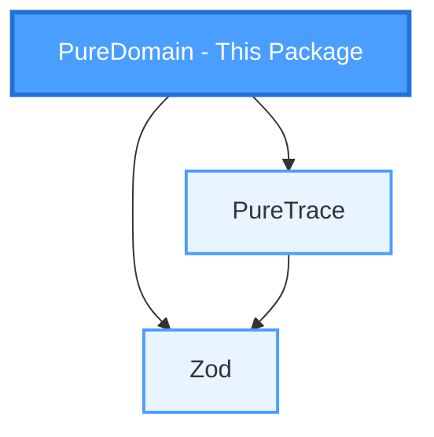

# PureDomain

> TypeScript framework for building business domains following Domain-Driven Design (DDD) principles,
> built on top of PureTrace for functional error handling and Zod for schema validation.

## Why PureDomain ?

- **Pure Domain Models**: Focus on business logic without infrastructure concerns
- **Type-Safe**: Full TypeScript support with Zod schema validation
- **Functional Error Handling**: Leverages PureTrace for composable error management
- **DDD-First**: Designed specifically for Domain-Driven Design patterns
- **Framework Agnostic**: Use with any persistence or application layer

## PureDomain in the PureFramework

PureDomain is part of the **PureFramework** ecosystem:



## Installation

```bash
npm install @gilles-coudert/pure-domain @gilles-coudert/pure-trace zod
```

## Quick Start

```typescript
import { z } from 'zod';
import { createPureEntity } from '@gilles-coudert/pure-domain';

// 1. Define your domain schema
const UserSchema = z.object({
    id: z.string().uuid(),
    email: z.string().email(),
    name: z.string(),
});

// 2. Create an entity
const User = createPureEntity(UserSchema);

// 3. Use it
const userResult = User.create({
    id: '550e8400-e29b-41d4-a716-446655440000',
    email: 'john@example.com',
    name: 'John Doe',
});

// 4. Handle the result
if (userResult.isSuccess()) {
    const user = userResult.value;
    console.log(`User created: ${user.properties.name}`);

    // 5. Update immutably
    const updatedResult = user.patch({ name: 'Jane Doe' });
    if (updatedResult.isSuccess()) {
        console.log(`Updated: ${updatedResult.value.properties.name}`);
    }
}
```

## Documentation

- [API Reference](docs/api.md) - Complete API documentation
- [Best Practices](docs/best_practices.md) - Development guide for humans and AI agents
- [Examples](docs/examples.md) - Practical examples following best practices

## Contributing

Contributions are welcome.

### Mandatory branch naming

Branch prefixes are **required** and define the semantic impact of the change:

- `upgrade/` → breaking changes (major version)
- `us/` → new features (minor version)
- `fix/` → bug fixes (patch version)

### Why not Conventional Commits?

Versioning information belongs to the **branch**, not individual commits.

Branches express intent and scope.
Commits should stay frequent, descriptive, and free of artificial prefixes that often degrade into `wip:` or `chore:` without semantic value.

## License

This project is licensed under the **Mozilla Public License 2.0 (MPL-2.0)**.

## Author

**Gilles Coudert**

- Email: [pure.framework@gmail.com](mailto:pure.framework@gmail.com)
- GitHub: [https://github.com/GillesCoudert](https://github.com/GillesCoudert)
